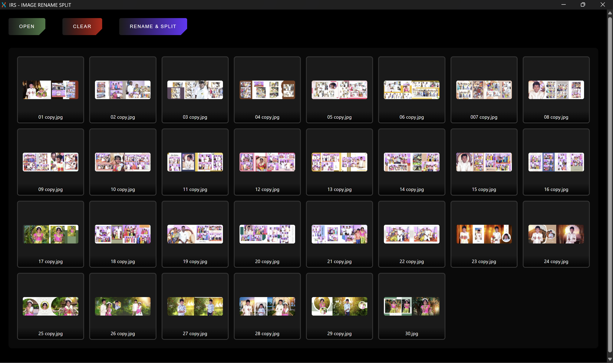
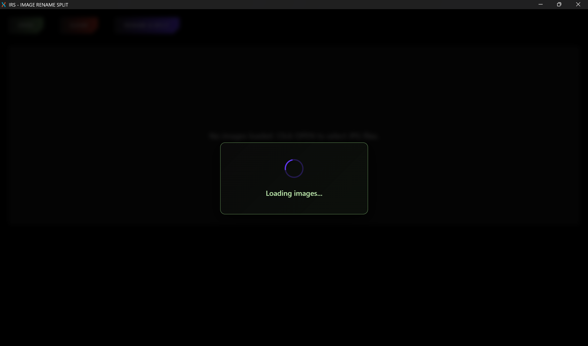
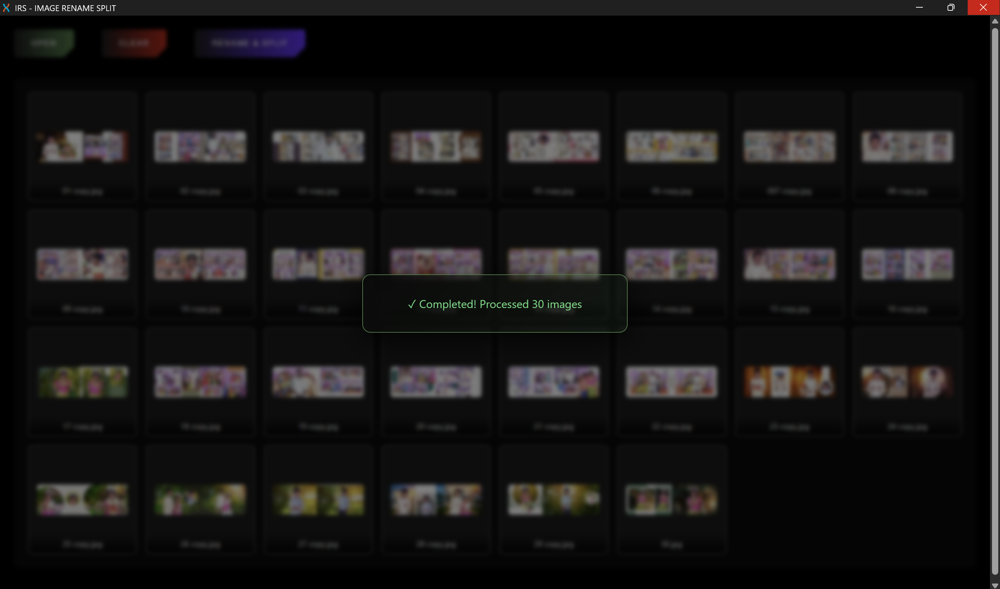

# IRS - Image rename split

IRS is a image editing tool for printing services. It takes n images, split them vertically into two equal half and rename it as x_1 and x_2 for the left and right part respectively. Perfect for printing 
photo albums.

---
## Showcase

---
## Code 

IRS is created using Rust 🦀 and Dioxus 🧬 tuned for windows.

---
>[!info]
> + rearranging the order of the images and other features will be implemented soon.
> + web version soon.
